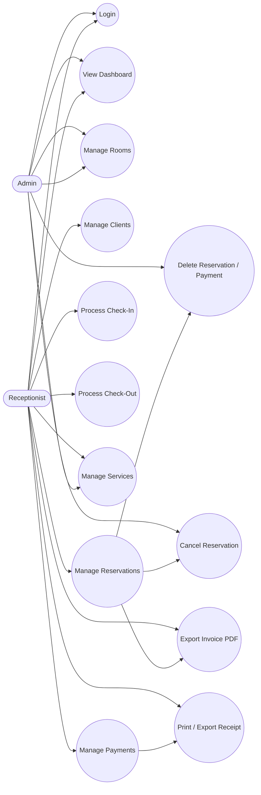
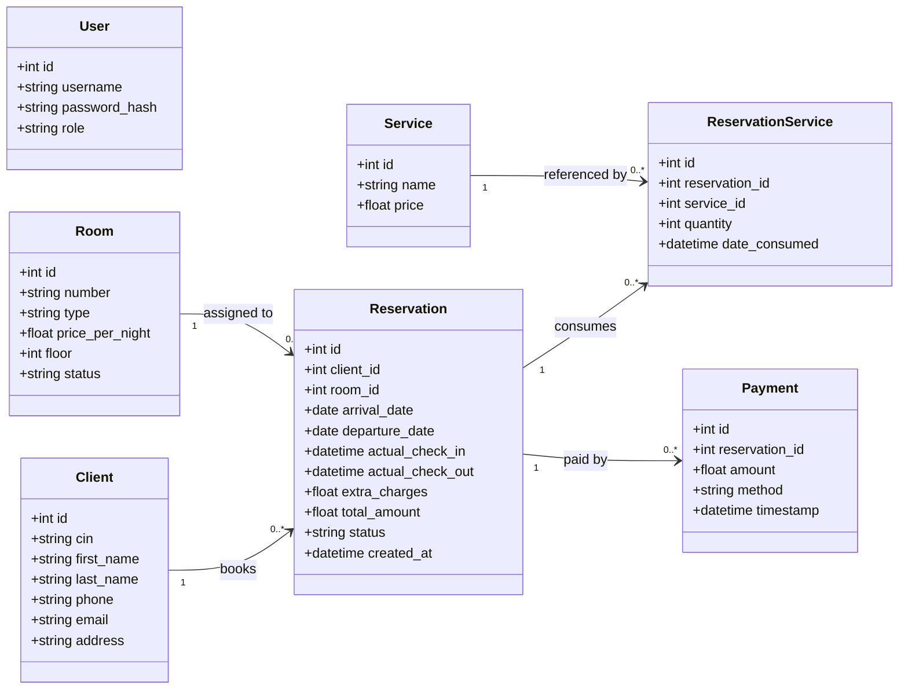
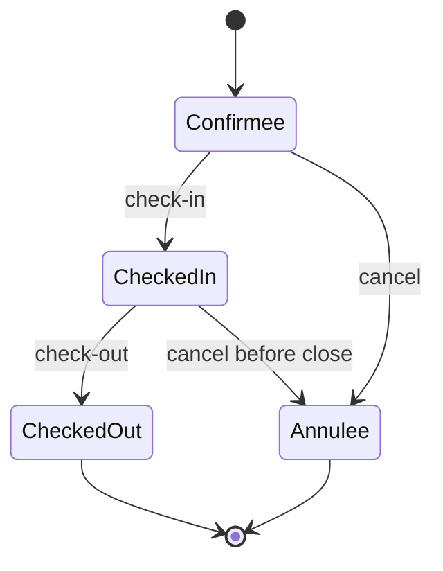
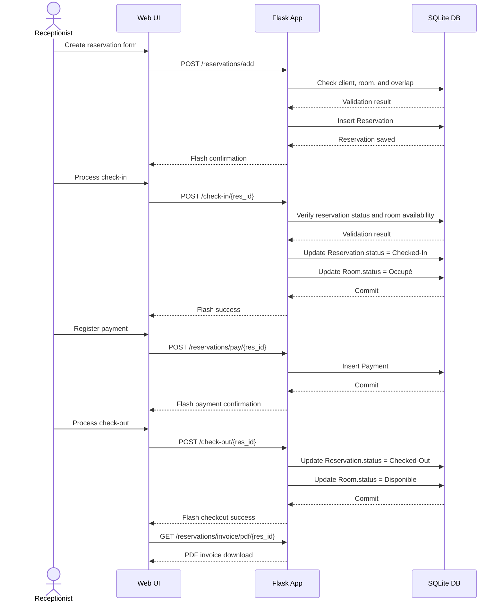

# UML Analysis - Hotel Management System

This document summarizes the main UML analysis diagrams for the current Flask hotel management project.

## 1. Use Case Diagram

## 2. Class Diagram

## 3. Reservation State Diagram

## 4. Sequence Diagram - Reservation Lifecycle

## 5. Main Business Rules

- A reservation must not overlap another active reservation for the same room.
- Check-in is allowed only on or after the arrival date and before the departure date.
- Check-out closes the stay and makes the room available again.
- Services can be attached to an active reservation and increase the total amount.
- Payments are tied to a reservation and are used to track balance.
- Closed reservations are intended to be read-only except for export actions.

## 6. Notes For Report

- The system is centered on `Reservation` as the main aggregate.
- `ReservationService` acts as the association class between `Reservation` and `Service`.
- `Payment` and `Service` are both dependent on an existing reservation context.
- The current implementation already maps cleanly to a standard hotel PMS domain model.
